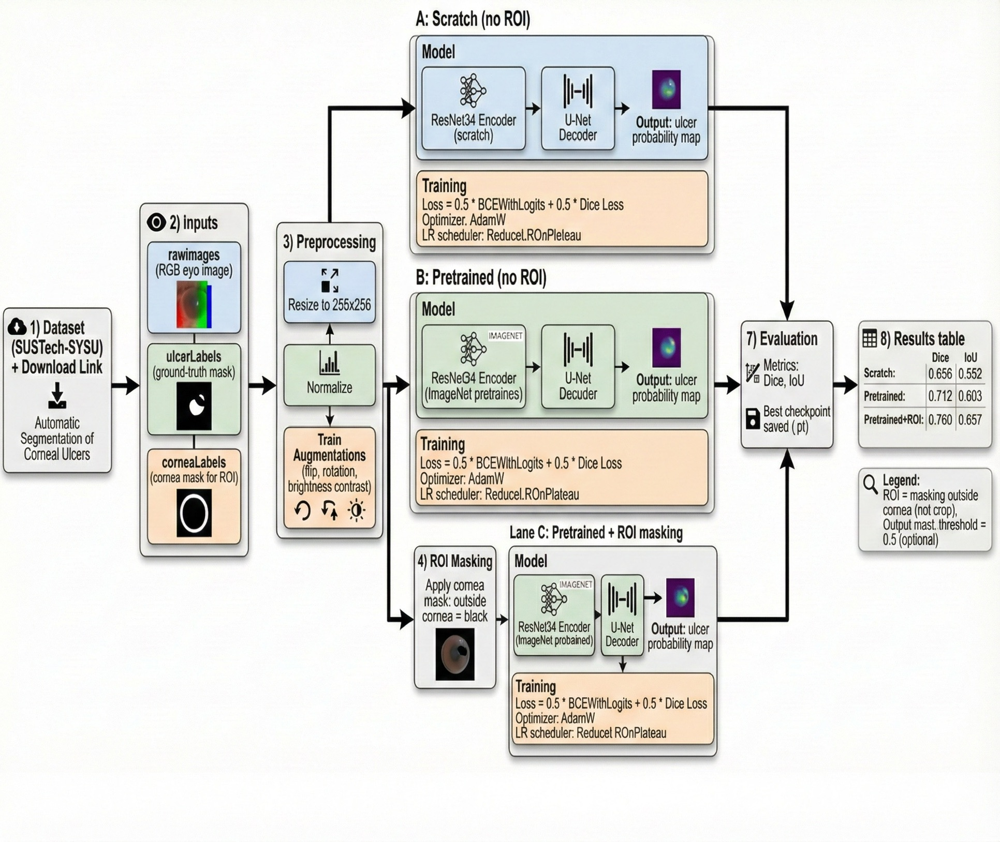

# Automatic Segmentation of Corneal Ulcers (SUSTech-SYSU)

Segmentation of corneal ulcers using a U-Net style decoder with a ResNet34 encoder.

## Background
Corneal ulcers are a serious ophthalmic condition that can lead to vision loss if not diagnosed and monitored accurately. Manual annotation of ulcer regions is time-consuming and requires expert clinicians. Automatic segmentation aims to assist clinical workflows by providing fast, consistent, and objective localization of ulcer regions in fluorescein-stained eye images.  
This project explores how transfer learning and anatomical priors (cornea-based ROI masking) can improve segmentation accuracy compared to training from scratch.


Project includes three experiments:
1) Train from scratch (no ROI)
2) Pretrained encoder (no ROI)
3) Pretrained + ROI (mask everything outside the cornea using corneaLabels)


## Pipeline




## Repo structure
```
repo/
|-- data/
|   |-- dataset_url   - link to download the dataset
|   |-- dataset_index.csv    - dataset split index
|
|-- notebooks/
|   |-- EDA.ipynb          # dataset validation + visuals
|   |-- training_and_evaluation.ipynb     # training + evaluation + plots
|
|-- src
|   |-- build_dataset_index.py  - builds dataset index and data splits
|        
|-- README.md

```

## How to run (Colab)
1) Mount Google Drive and `cd` into the project folder.
2) Ensure `data/dataset_index.csv` exists.
3) Run `notebooks/training_and_evaluation.ipynb` to train and compare all 3 experiments.

## Test results
| Method | Test Dice | Test IoU |
|---|---:|---:|
| Scratch (no ROI) | 0.6381 | 0.5364 |
| Pretrained (no ROI) | 0.6870 | 0.5817 |
| Pretrained + ROI | 0.7442 | 0.6429 |

## Notes
- Loss: 0.5 * BCEWithLogits + 0.5 * Dice loss
- Metrics: Dice, IoU
- ROI here means masking outside the cornea (not crop), using corneaLabels.
